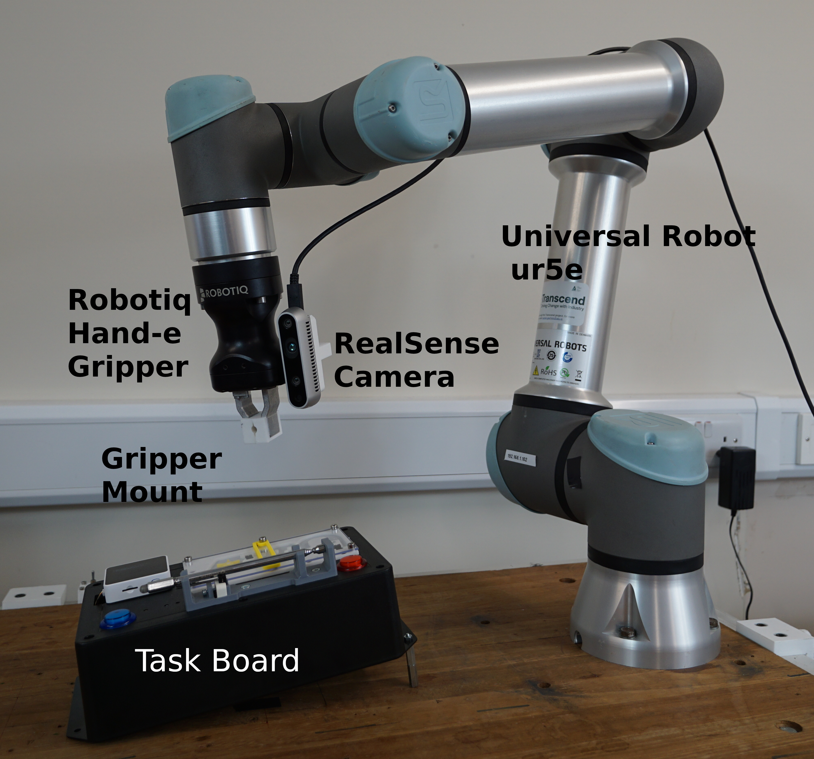
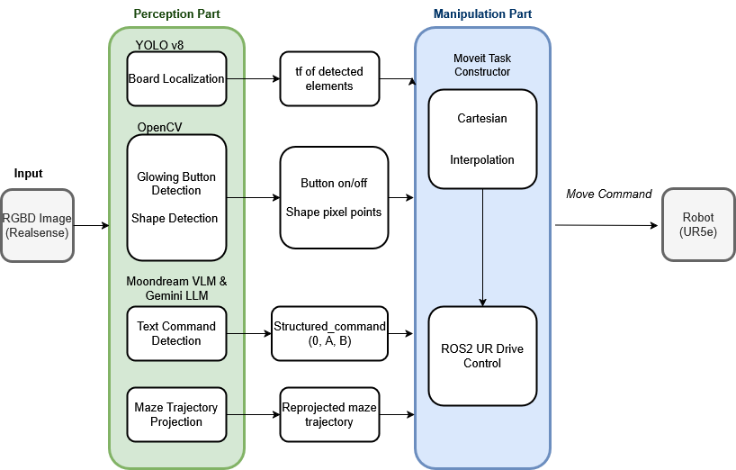
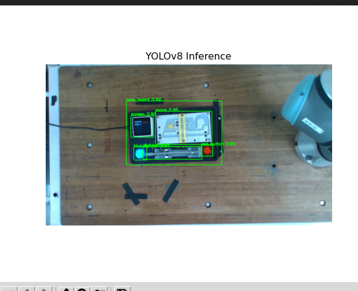
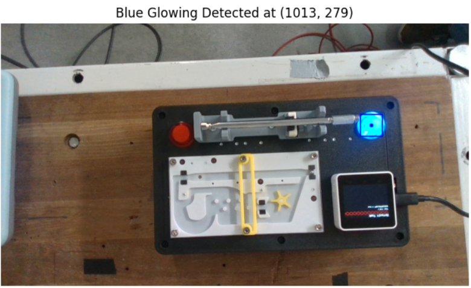
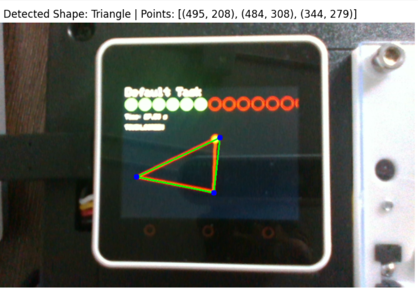
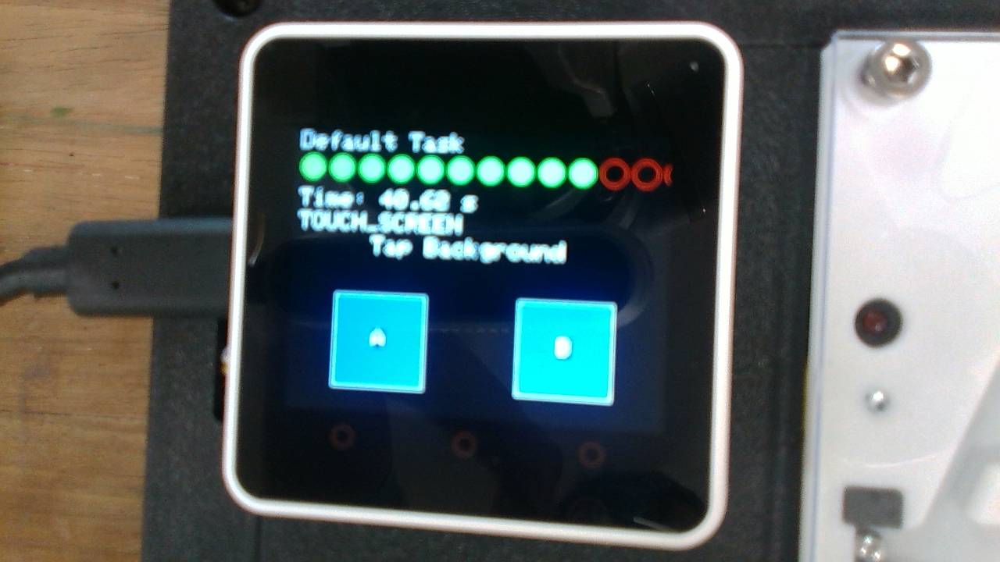

# Robothon 2025 – Team Atlabotics
 
This repository contains our submission to the **Robothon 2025 Grand Challenge**. 
 
Our robotic system leverages a **UR5e robotic arm**, equipped with an **Intel RealSense D345 camera** and a **Robotiq Hand-E gripper**, to perform a series of **perception and**  **manipulation** tasks on the challenge **taskboard**.
 
---
 
## Hardware Setup
 
The following hardware components were used in our system:
 
- **UR5e** robotic arm 
- **Robotiq Hand-E** gripper 
- **Intel RealSense D435** depth camera 
- **Stylus holder mount** 
- **Robothon 2025 Taskboard**
 
 
---
 
## Software Setup
 
Our software framework is developed using ROS2 (Robot Operating System). The overall framework is organaized inside the **Robothon** workspace.
 
 
### System Requirements
 
- **Ubuntu 22.04** 
- **ROS 2 Humble Hawksbill** 
- **Python 3.10.2** 
- **MoveIt 2**
 
### Software Dependencies
- [Intel realsense ros driver](https://github.com/IntelRealSense/realsense-ros)
- [OpenCV](https://github.com/opencv/opencv)
- [Skimage](https://scikit-image.org/)
- [Yolo v8](https://github.com/autogyro/yolo-V8)
- [Moondream](https://github.com/vikhyat/moondream)
- [Gemini](https://pypi.org/project/google-generativeai/0.3.2/)
- [MoveIt2](https://github.com/moveit/moveit2)
- [Moveit Task Constructor](https://moveit.picknik.ai/main/doc/concepts/moveit_task_constructor/moveit_task_constructor.html)
 
---
 
## System Overview and Task Breakdown
 
The overview of the system is illustrated in the diagram below.
 

 
The **vision system** is responsible for detecting and localizing the **Robothon taskboard** within the robot's workspace. It also handles:
 
- Detection of **glowing buttons** on the board 
- Recognition of **geometric shapes** 
- Extraction of **task descriptions** displayed on the board screen
 
The **ROS control driver** and **MoveIt 2 task planner** coordinate the overall task planning and motion execution of the robot. 
 
Once the taskboard is localized and the positions of its components are transformed into the robot’s **`base_link`** frame, the task planner can execute the required tasks sequentially, based on the updated positions of each element.
 
 
 
### Task 1: Board Localization
 
- A **YOLOv8** model was trained to detect the **taskboard**, **buttons**, **touchscreen**, **maze**, and **stylus**. The model was trained using 120 diverse images of the board.
- A **coordinate frame** is attached to each of the detected elements. The z-axis of each elements frame was chosen initially to be in the same direction of the camera_color_optical_frame z-axis. and the x-axis was fixed to be in the direction from red button to blue button. The a rotation angle around the y-axis was applied to take into account the oriantation angle of the challenge board.
- We can publish and vizualize the different elements' frames with **RViz**.
- **Transformations** between any two coordinate frames can be obtained using the **`tf2`** library.
 

 
### Task 2: Button Detection
 
- In this task we use **OpenCV**-based image processing to detect which button is glowing for the robot to press it. For that, we  created **HSV** ranges for glowing and idle red and blue to detect changes in their light intensities. The code follws the logic:
- If `red_glow and blue_idle = TRUE`, then publish Red Glowing to the ROS topic `/detection_label`.
- If `red_idle and blue_glow = TRUE`, then publish Blue Glowing to the ROS topic `/detection_label`.
- Else publish No glowing button detected.
- Based on the published message, the robot presses the buttons which are already detected in the localization from **Task 1**.
 

 
 
### Task 3: Shape Detection

- For shape detection, we use **OpenCV**-based image manipulation techniques to extract and approximate the shape displayed on the touch screen.
- The robot reaches a predefined position atop the touchscreen which was detected during localization in **Task 1**. The white mask is created along the edges of the touchscreen to restrict the detection to inside region only. The distortion caused by the **progress bar circles** on the top of the screen is removed using a specific radius range in `HoughCircles`. The main shape (shown in red) on the screen is then isolated using a **red color mask** and then skeletonized.
At this point the image maybe distorted so we use `fitEllipse` and `approxPolyDP` to approximate the **skeletonized** contour and determine whether the shape is a circle, triangle or a square.
- The ordered pixel endpoints of the detected shape are published to the ROS topic `/detection_point` for tracing.
 
 

 
 
 
### Task 4: Text-Based Command Execution (VLM and LLM)
 
For the text-based task execution stage, we relied on **Vision-Language Models (VLMs)** and **Large Language Models (LLMs)** to understand and interpret the semantics of the task commands. 
Due to the **randomly generated nature** of the tasks, using static or hard-coded handling methods was not feasible. Instead, language models enabled dynamic interpretation and execution of the tasks based on natural language input.
 
We relied on a **Vision-Language Model (VLM)** to extract the text displayed on the screen, as the **RGB images from the Intel RealSense D435** were often **blurry at close range**. This made traditional approaches using **OpenCV and OCR** unreliable.
 
To address this, we used the **Moondream2 2B** model to extract raw text from the screen. 
The output text was then passed to the **Gemini 1.5 Flash** model, which was prompted to convert each task description into a fixed command format: 
`(action_id, start_point, end_point)`.
 
- If `action_id = 0`, this indicates a **simple move** from `start_point` to `end_point`. 
- If `action_id > 0`, this indicates a **repeated action**, performed `action_id` times (e.g., "Tap A three times"). 
- If `action_id = -1`, this indicates a **long action** (e.g., "Long press A").
 
The resulting structured command is then **published to the `/structured_command` ROS topic** for execution.


 
### Task 5: Maze Solving
 
For the maze-solving task, we **manually recorded the solution path** once, relative to the coordinate frame of the **blue button**, while the board was in a known and fixed location.
 
When the board is **randomly repositioned**, the system **reprojects the saved path** into the robot’s **`base_link`** frame. This is possible because the **transformation between the blue button and the `base_link`** frame is known via `tf2`.
 
The transformed path is then passed to the **motion planner**, which executes the trajectory to solve the maze.

 
## System Execution / Quick Start Guide
 
Before running the system, install the following open-source modules:
 
 
#### 1. Intel Realsense ROS Driver
Install via ROS2:
```bash
sudo apt install ros-humble-realsense2-camera
```
 
For Python API access:
```bash
pip install pyrealsense2
```
 
#### 2. OpenCV
```bash
pip install opencv-python
```
 
####  3. Skimage (scikit-image)
```bash
pip install scikit-image
```
 
####  4. YOLOv8 (via Ultralytics)
```bash
pip install scikit-image
```
 
####  5. Moondream (VLM model)
```bash
pip install moondream
```
 
####  6. Gemini (Google Generative AI)
```bash
pip install google-generativeai
```
 
####  7. MoveIt
```bash
sudo apt install ros-humble-moveit
```
 
#### 8. Clone the atlabotics-robothon repository

```bash
git clone https://github.com/Atlantic-Robotics-Lab/atlabotics-robothon.git
```

- The robot URDF requires change and can be replaced by the file available in the [Universal_Robots_ROS2_Description](https://github.com/UniversalRobots/Universal_Robots_ROS2_Description/tree/humble) repository.
- 

- From the [Universal_Robots_ROS2_Driver](https://github.com/UniversalRobots/Universal_Robots_ROS2_Driver/tree/humble), the SRDF and MOVEIT config launch require update to ensure the fixed configurations and moveit task constructor can be executed.
- 
- 


> **NOTE**
- Add API keys for moondrean2 and gemini 1.5 flash required for running the simple_service_pipeline - for the VLM and LLM, which will otherwise not work.
[pipeline_node.py](simple_pipeline_service/simple_pipeline_service/pipeline_node.py)

- Modify the absolute path which contains the training dataset information and trained model [board_localization_launch.py](perception_system/launch/board_localization_launch.py)

- Modify the absolute the path which contains the path to the maze_path.csv [moveit_interface](https://github.com/Atlantic-Robotics-Lab/atlabotics-robothon/blob/759f433dd87736323bb723badb569aae4162b11b/moveit_interface/src/moveit_interface.cpp#L604)

To start the system, following launchers are required:
 
- UR5 launcher: This will launch the robot.
- Moveit launcher: This will launch the moveit configuration with task constructors
- realsense launcher: This will launch the realsense node and start publishing camera frames with the aligned depth topic enabled.
- Gripper launcher: This will launch the server to send gripper service requests.
- Pipeline Launcher: This will launch the VLM and LLM models that will be triggered during text detection. 
- Perception system launcher: This will launch all the services related to board localization, glowing button detection, shape detection and text command detection.
- Moveit Interface: This is the main node that handles all task execution by calling services and managing the execution order during operation.

Run the following commands sequentially to launch them

```bash
ros2 launch ur_robot_driver ur_control.launch.py ur_type:=ur5e robot_ip:=192.168.x.x launch_rviz:=true
ros2 launch ur_moveit_config ur_moveit.launch.py ur_type:=ur5e robot_ip:=192.168.x.x
ros2 launch realsense2_camera rs_launch.py align_depth.enable:=true
ros2 launch robotiq_hande_ros2_driver gripper_bringup.launch.py robot_ip:=192.168.x.x
ros2 launch simple_pipeline_service pipeline.launch.py
ros2 launch perception_system board_localization_launch.py
ros2 launch moveit_interface moveit_interface.launch.py  ur_type:=ur5e robot_ip:=192.168.x.x
```

To start task execution, trigger the service as follows:
```bash
ros2 service call /trigger_task std_srvs/srv/Trigger {}\
```

---
 
## Authors
 
- [Dipshikha Das](https://github.com/dipshikha-das)
- [Ali Al Abbas](https://github.com/Ali-Alabbas)
- [Abdullah Haider Ali](https://github.com/abdullahhaiderali)
- [Camillo Murgia](https://github.com/Camillo99)
 
Affiliation: Atlantic Technological University